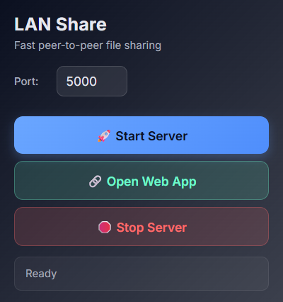
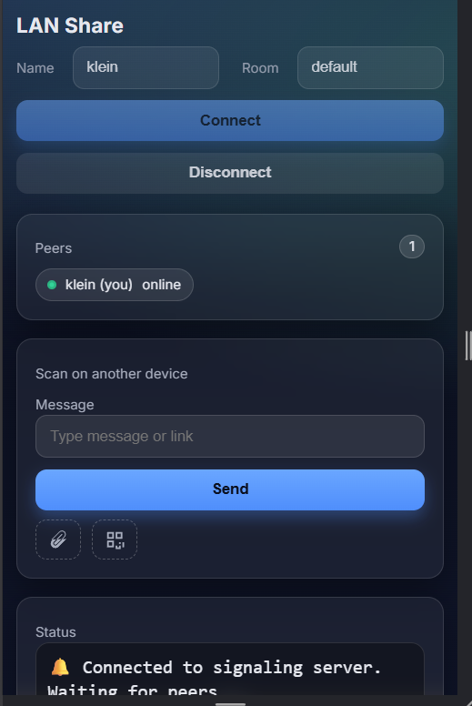
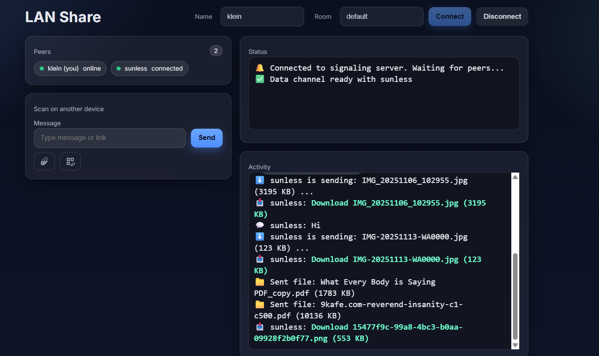

# LAN Share (Extension + Native Host + Python Signaling)

A minimal local WebRTC "LAN Share" app with:

- A Chrome extension that starts the local Python signaling server via Native Messaging and opens the web app.
- A Python Flask + Socket.IO server that serves a simple client and acts as a signaling relay for WebRTC peers.
- OS-specific native host launchers (Windows `.bat`, Unix `.sh`).

## Project Layout

- `server.py` – Flask + Socket.IO signaling server (port 5000 by default)
- `static/client.html` – Simple WebRTC client (connect, chat, send images/files via P2P)
- `extension/` – Chrome extension UI
  - `manifest.json` – Permissions and service worker
  - `popup.html` – Popup UI (Start Server)
  - `popup.js` – Start flow w/ native messaging + polling
  - `background.js` – Minimal service worker
- `native-host/` – Native messaging manifests and launchers
  - `lan_share_host_windows.json` – Windows native host manifest
  - `lan_share_host_unix.json` – Unix native host manifest (edit paths)
  - `start_server.bat` – Windows launcher (spawns Python, prints `{ "started": true }`)
  - `start_server.sh` – Unix launcher (spawns Python in background)
  - `register_native_host_windows.reg` – Helper registry file for Chrome (Current User)

## Screenshots

Quick visual reference for the extension and web client (images are in the `Photo/` folder):

### Extension Popup
Modern popup UI with the Start/Stop controls and QR code.



### Phone Interface
Responsive web UI shown on a smartphone.



### Desktop Client
Desktop view of the web client.




## Quick Start (Windows)

1. Install Python 3.13 (or your version). Note its path, e.g.
   `C:\\Users\\<you>\\AppData\\Local\\Programs\\Python\\Python313\\python.exe`.

2. Edit `native-host/start_server.bat` and set:
   - `PYTHON_EXE` to your Python path (already set for the example user)
   - `PROJECT_DIR` to the project folder (e.g., `D:\\lan share`)

3. Register the native host with Chrome:
   - Double-click `native-host/register_native_host_windows.reg` and accept the prompt, or
   - Manually create the registry key:
     - `HKEY_CURRENT_USER\Software\Google\Chrome\NativeMessagingHosts\lan_share_host`
     - Default value: `d:\\lan share\\native-host\\lan_share_host_windows.json`

4. Verify the batch works:
   - Open Command Prompt and run:
     ```cmd
     "d:\\lan share\\native-host\\start_server.bat"
     ```
   - You should see `{"started": true}` and the server should start.

5. Load the extension:
   - Open `chrome://extensions`, enable Developer mode.
   - Click "Load unpacked" and select the `extension/` folder.
   - Click the extension icon → "Start Server". It should open `http://localhost:5000`.

## Quick Start (Linux/macOS)

1. Edit `native-host/start_server.sh` and set `PYTHON_BIN` and `PROJECT_DIR`.
2. Update `native-host/lan_share_host_unix.json`:
   - Set `path` to the absolute path of `start_server.sh`.
   - Ensure `allowed_origins` uses your extension ID.
3. Register the native host (example for Chromium on Linux):
   - Copy/ln the JSON to: `~/.config/chromium/NativeMessagingHosts/lan_share_host.json`.
   - Or for Chrome: `~/.config/google-chrome/NativeMessagingHosts/lan_share_host.json`.

## Troubleshooting

- Extension popup shows: "Failed to contact native host" – Check registry value points exactly to the JSON and that `start_server.bat` runs manually. Restart Chrome after changes.
- Button text is garbled – `popup.html` includes `<meta charset="utf-8">`.
- Server not reachable – `popup.js` polls `http://localhost:5000`; ensure firewall allows local connections and no other process uses 5000.
- Phone cannot access server – Open the server URL printed in console (uses local IP). Port forward or stay on same LAN.

## Security Notes

- This is LAN-only by design. There is no authentication and CORS is `*`.
- Do not expose this server to the internet without adding authentication and transport security.

## License

MIT (c) 2025
